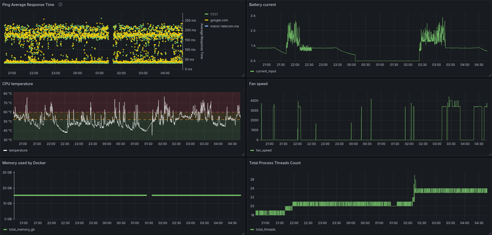

# Monitoring system



> System to monitor Linux server metrics, including CPU, memory, and disk usage.

- Collect Linux system metrics using Python scripts or [Telegraf](https://docs.influxdata.com/telegraf/v1/).
- Store metrics in [TimescaleDB](https://www.timescale.com/), a time-series database with full SQL support built on top of PostgreSQL.
- Visualize data with customizable Grafana dashboards.
<!-- - Version-controlled dashboards using YAML provisioning. -->
<!-- - Real-time alerts. -->
- Easy deployment with Docker Compose.


## Getting started

```bash
docker compose up -d
virtualenv .venv & source .venv/bin/activate
pip install -r requirements.txt
python src/main.py
```

## System metrics

For an extensive list of interesting system metrics, please see [docs/metrics.md](docs/metrics.md).

<!-- TODO add a short list of the one implemented -->
## Stack

### Data collection

Data collection can be performed using multiple options:
1. Custom Python scripts, based on [psutil](https://github.com/giampaolo/psutil) for example.
<!-- `psutil` -->
2. [Telegraf](https://docs.influxdata.com/telegraf/v1/)

Telegraf provides great features:
- Lightweight: packaged in a single binary with no dependencies
- Unobtrusive with its low resource usage
- Cross-platform support: Linux, Windows, macOS, and Docker
- Rich and established marketplace of plugins


### Data storage

TimescaleDB: time-series database with full SQL support, built on top of postgreSQL
The schema and tables of data are automatically created by Telegraf.

### Data visualization

Grafana
Each dashboard contains multipe panels. Each panel can be defined as a SQL query, with further UI customization.